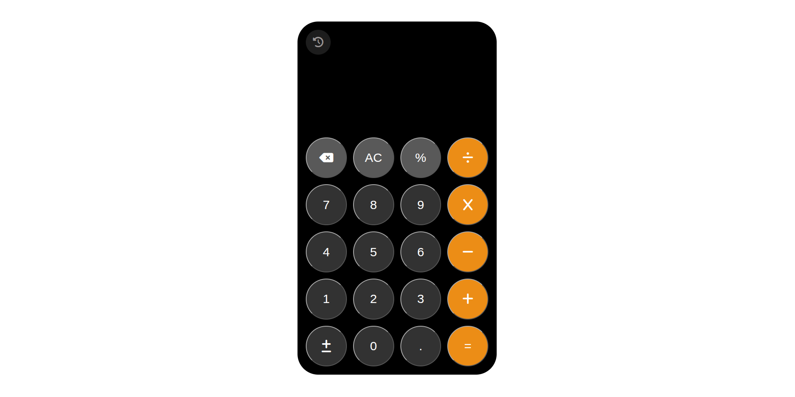
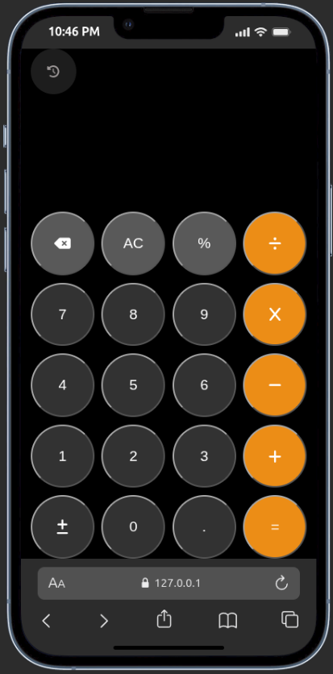

# 🏷 Calculator

A basic iphone calculator built with HTML, CSS and Js.

## 📌 Problem Statement

After studying Js I needed a little project i can built to text my skill in the language and the calculator, though basic teaches me how to add functionalities to an app.

## 🎯 Project Goals

- Input numbers
- separate numbers with a mathematical operators.
- Perform Operation and return result
- Show errors if any

## 🛠 Tech Stack

**Frontend:**  

- HTML  
- CSS  
- Js
- GitHub
- vercel(deployment)

## 🖥 Features

- Mathematical operations
- Responsive design
- Error handling

## 📷 Screenshots




Clone the repository:

```bash
git clone https://github.com/karl-Rollins/iphone_calculator.git
cd iphone_calculator
```

Go live

## 🧠 Challenges Faced

- calculation logic
- replacing * with x so that the code understands.

## 📚 What I Learned

- The eval() method treats % as modulo instead of percentage which is bad for a calculator.

## Future Improvements

- Better UI
- Responsive UI
- Error Messages

## 👨🏽‍💻 Author

NGANGSI Karl
Junior Fullstack Developer

📩 Email: [karlrollins25@gmail.com](mailto:karlrollins25@gmail.com)

🌍 Based in Cameroon | Open to remote opportunities
